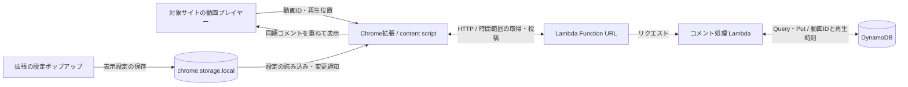

# Commentator
動画の再生時刻に同期したコメントを表示・投稿するChrome拡張機能です。YouTube、Netflix、Amazon Prime Video向けのプレイヤー検出処理を持ちます。

## 技術構成
TypeScript / React 18 / Vite / Chrome Manifest V3 / AWS CDK / Lambda / DynamoDB / Playwright。
- [client/src/content-scripts](client/src/content-scripts): プレイヤー検出・コメント描画・入力UI
- [client/public/manifest.json](client/public/manifest.json): 拡張権限と対象ページ
- [backend/lambda/comment.ts](backend/lambda/comment.ts): コメント取得・投稿API
- [backend/lib/backend-stack.ts](backend/lib/backend-stack.ts): AWSリソース定義
- [docs](docs): 紹介ページ・プライバシー説明
- [e2e](e2e): ブラウザ確認用テスト

## システムアーキテクチャ



- プレイヤーとの連携・先読み・描画は [content script](client/src/content-scripts/main.tsx)、サイト選択は [platform factory](client/src/content-scripts/platforms/factory.ts) が担当します。
- [設定画面](client/src/main.tsx) はブラウザ内ストレージを使います。コメント本文の保存先は [Lambda](backend/lambda/comment.ts) が操作する DynamoDB です。
- Function URL とテーブルは [CDK定義](backend/lib/backend-stack.ts) にあります。利用するAWS環境へデプロイして使用します。
- コメントは再生時刻に合わせたHTTP取得です。WebSocketによる配信ではありません。

## クライアントのセットアップ
Node.js・npmと、下記バックエンドのAPI URLが必要です。
```sh
cd client
npm install
cp .env.example .env.local
# VITE_API_URL を設定
npm run build
```
Chromeの拡張機能管理画面で開発者モードを有効にし、生成された client/dist を読み込みます。拡張権限と対象ページは manifest.json で確認できます。

VITE_API_URL は拡張の配布ファイルに含まれる公開設定です。APIキーなどの秘密値は入れないでください。

## バックエンドのビルド・テスト
```sh
cd backend
npm ci
npm run build
npm test -- --runInBand
```
デプロイにはAWSアカウント・権限・CDKの実行環境が必要です。CDKの出力 ApiUrl を VITE_API_URL に設定してクライアントを再ビルドします。

## データとAPI設定
- コメントは動画IDと再生時刻をキーにDynamoDBへ保存します。
- Function URLは認証方式 NONE、CORSは全origin許可の構成です。
- テーブルは RemovalPolicy.DESTROY のため、スタック削除時にデータも削除されます。データを保持する環境では保持ポリシーを変更してください。
- 対象サイトのプレイヤーDOMに依存する処理は client/src/content-scripts/platforms 配下で管理します。
